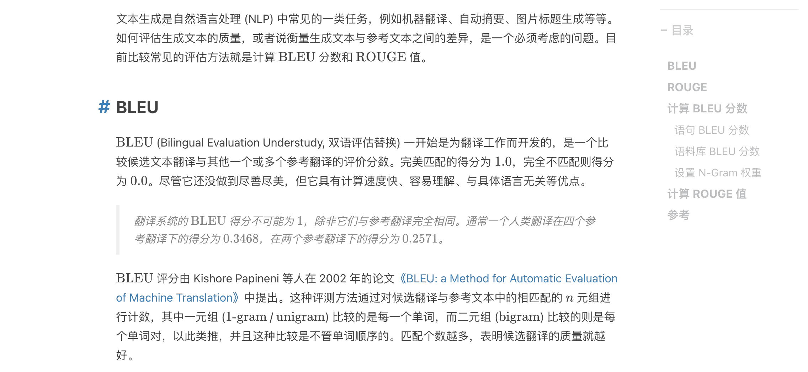
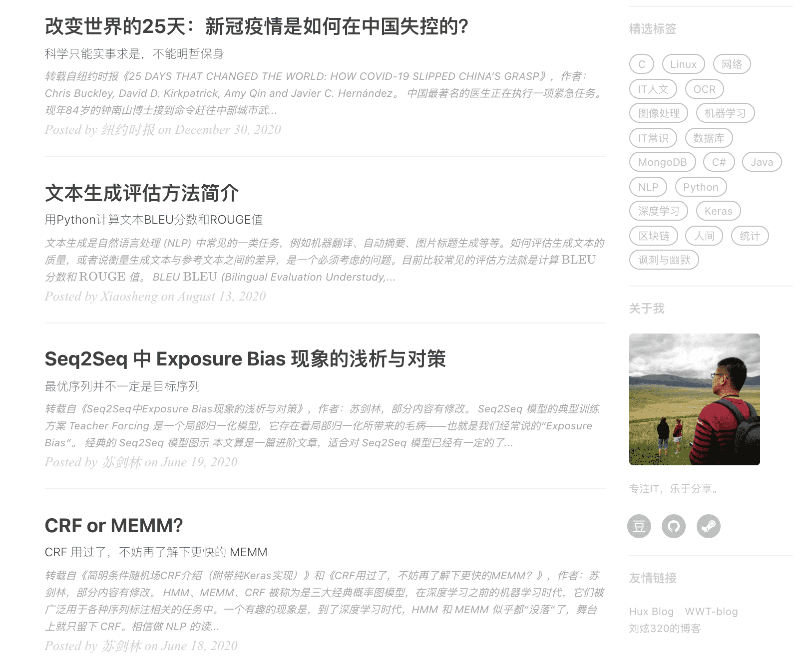

# 说明文档

* 开始
  * [环境要求](#environment)
  * [开始](#get-started)
  * [写一篇博文](#write-posts)
* 各组成部分
  * [侧边栏](#sidebar)
  * [自我简介](#mini-about-me)
  * [标签云](#featured-tags)
  * [好友链接](#friends)
* 评论系统
  * [网站评论](#comments)
* Baidu Analytics
  * [网站分析](#analytics)
* 高级部分
  * [标题底图](#header-image)
  * [搜索展示标题-头文件](#seo-title)
* 其他
  * [安装 jekyll](#install-jekyll)

### Environment

如果你已经安装了jekyll，那么你只需要切换到 *xs-huxblog* 目录，然后输入 `jekyll serve` 就能在本地浏览器中预览主题。

如果你还没有安装 jekyll，那么可以参考 [安装 Jekyll](#install-jekyll)。

### Get Started

你可以通用修改 *_config.yml* 文件轻松地开始搭建自己的博客：

```
# Site settings
title: 小昇的博客                # 你的博客网站标题
SEOTitle: Xs Blog              # 在后面会详细谈到
description: "Cool Blog"       # 随便说点，描述一下
# SNS settings
douban_username: 138483825     # 你的豆瓣账号
github_username: jsksxs360     # 你的github账号
weibo_username: jsksxs360      # 你的微博账号
zhihu_username: jsksxs360      # 你的知乎账号
# Build settings
# paginate: 10                 # 一页你准备显示几篇文章
```

关于评论系统和网站统计的相关设置，请参考 [网站分析](#analytics)。

Jekyll 官方网站还有很多的参数可以调，比如设置文章的链接形式...网址在这里：[Jekyll - Official Site](http://jekyllrb.com/) 中文版的在这里：[Jekyll中文](http://jekyllcn.com/)。

### write-posts

要发表的文章一般以 markdown 的格式放在目录 *_posts/* 下，你只要看看这篇模板里的文章就能立刻明白该如何设置。

yaml 头文件长这样:

```
---
layout: post
title: "Hello 2016"
subtitle: "Hello World, Hello Blog"
date: 2016-01-29 12:00:00
author: "Xiaosheng"
header-img: "img/bg/bg_2016.jpg"
catalog: true
tags:
    - Life
---
```

其中，layout 代表页面的类型，普通文章请设置为 post。catalog 为文章目录，会自动提取各级标题，显示在文章右侧。如下图所示：




### SideBar

长这样:



设置是在 *_config.yml* 文件里面的 `Sidebar settings` 那块。

```
# Sidebar settings
sidebar: true  #添加侧边栏
sidebar-about-description: "简单的描述一下你自己"
sidebar-avatar: /img/avatar-xs.jpg     #你的大头贴，请使用绝对地址.
```

侧边栏是响应式布局的，当屏幕尺寸小于 992px 的时候，侧边栏就会移动到底部。具体请见bootstrap栅格系统 <http://v3.bootcss.com/css/>。如果你不想使用侧边栏，可以设置 `sidebar: false`。

### Mini About Me

自我简介这个模块将在你的头像下面，展示你所有的社交账号。这个也是响应式布局，当屏幕变小时候，会将其移动到页面底部，只不过会稍微有点小变化，具体请看代码。

### Featured Tags

看到这个网站 [Medium](http://medium.com) 的标签云非常的炫酷，所有将他加了进来。
这个模块现在是独立的，可以呈现在所有页面，包括主页和发表的每一篇文章标题的头上。

```
# Featured Tags
featured-tags: true
featured-condition-size: 1     # A tag will be featured if the size of it is more than this condition value
```

### Friends

友情链接部分。这会在全部页面显示。

设置是在 *_config.yml* 文件里面的 `Friends` 那块，自己加吧。

```
# Friends
friends: [
    {
        title: "Foo Blog",
        href: "http://foo.github.io/"
    },
    {
        title: "Bar Blog",
        href: "http://bar.github.io"
    }
]
```

### Comments

考虑到多说已经停运，而目前国内的评论系统大多需要备案，因此这里选择来自韩国的[来必力](https://www.livere.com/)或者通过无后端评论系统[Valine](https://valine.js.org/)自己搭建。来必力对中文的支持还不错，用户可以通过 QQ、微信、微博等方式登录进行评论，加载速度也还可以。Valine则是一款基于[LeanCloud](https://leancloud.cn/)的快速、简洁且高效的无后端评论系统。

#### 来必力

如果选择使用来必力，请先去[来必力](https://www.livere.com/)官网注册一个账号，然后在管理页面的代码管理中，找到类似 `<div id="lv-container" data-id="city" data-uid="MTAyMC80MjI1Ny8xODgwNA==">` 的部分，将 data-uid 之后的代码复制到 *_config.yml* 文件中，并且将 `labili` 设置为 true，就可以启用了：

```
# Livere来必力
labili: true
labili_uid: MTAyMC80MjI1Ny8xODgwNA==
```

**注意：labili_uid一定要替换成自己网站的uid**

#### Valine

如果选择使用Valine，请先去先[LeanCloud](https://leancloud.cn/)注册一个账号，然后进入[控制台](https://console.leancloud.cn/apps)后点击左上角的`创建应用`按钮：


一般的个人博客使用，选择“开发版”就足够了。应用创建好以后，进入刚刚创建的应用，选择左下角的 `设置` > `应用Keys`，就能看到应用的 AppID 和 AppKey 了：


然后将 AppID 和 AppKey 的值复制到 *_config.yml* 文件中，并且将 `valine` 设置为 true，就可以启用了：

```
# Valine评论系统
valine: false
valine_appId: 2cVvVbG3IswhpPz73iAzdy0R-gzGzoHsz
valine_appKey: oyPqL9vXtuyfiuLx81crp7Ck
```

**注意：valine_appId和valine_appKey一定要替换成自己应用的AppID和AppKey**

### Analytics

网站分析支持[百度统计](http://tongji.baidu.com)，你需要去官方网站注册一下。点击代码获取，然后在代码中找到类似 `hm.src = "//hm.baidu.com/hm.js?07529a93af5fa9f808261a1318c3aba4"` 的部分，将问号之后的一串数字复制到 *_config.yml* 文件中：

```
# Baidu Analytics
ba_track_id: 4cc1f2d8f3067386cc5cdb626a202900
```

**一定要使用你们自己的啊！**

### Header Image

标题底图是可以自己选的，看看几篇示例 post 你就知道如何设置了。

标题底图的选取完全是看个人的审美了，我也帮不了你。每一篇文章可以有不同的底图，你想放什么就放什么，最后宽度要够，大小不要太大，否则加载慢啊。

但是需要注意的是本模板的标题是**白色**的，所以背景色要设置为**灰色**或者**黑色**，总之深色系就对了。

### SEO Title

我的博客标题是 **“Xs Blog”** 但是我想要在搜索的时候显示 **“小昇的博客 | Xs Blog”** ，这个就需要 SEO Title 来定义了。

其实这个 SEO Title 就是定义了 `<head><title>标题</title></head>` 这个里面的东西和多说分享的标题，你可以自行修改的。

### Install Jekyll
因为 Jekyll 是用 Ruby 开发的，所以如果你的系统上没有安装，那么首先需要安装 Ruby：

```
$ sudo apt install ruby-full
```

安装后，输入 `ruby -v` 检查当前 Ruby 的版本，若正确显示则安装成功，然后接着安装 jekyll。

```
$ sudo apt install jekyll
```

至此 Jekyll 安装完成，你可以输入 `jekyll -v` 来检查，若正确显示 jekyll 的版本号则安装成功。

由于网站还使用到了分页功能，所以还需要安装 jekyll-paginate，你可以通过 `sudo gem install jekyll-paginate` 来安装。
