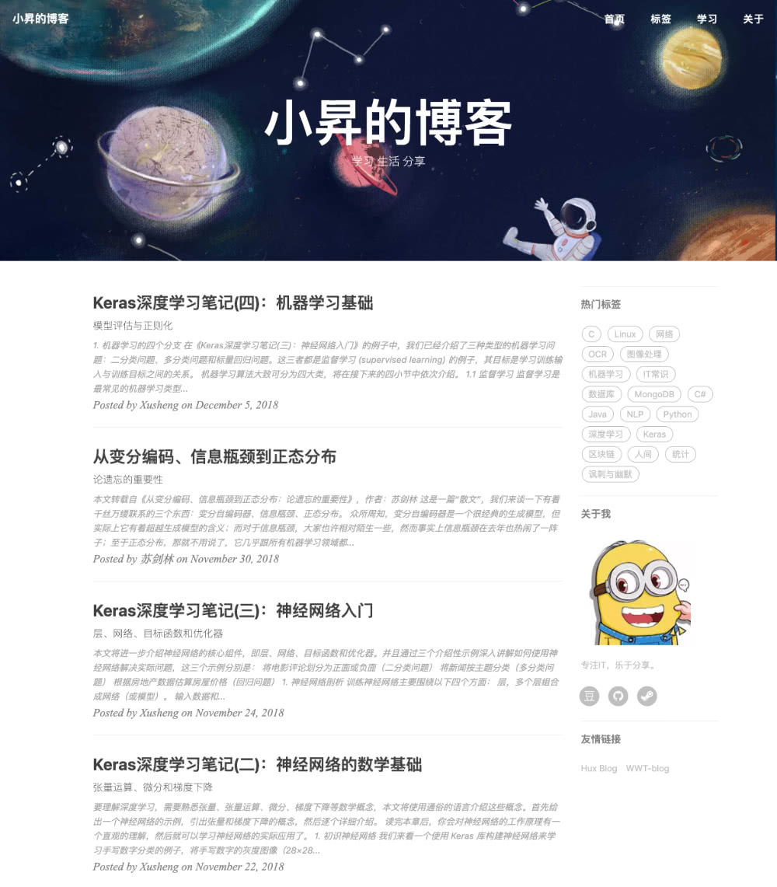

# Xs-HuxBlog
这是一个 jekyll 的主题模板，主要适用于搭建个人博客使用。模板修改自 [huxblog-boilerplate](https://github.com/Huxpro/huxblog-boilerplate) 主题，原作者为 [黄玄](http://huangxuan.me/)。

[我的博客](https://xiaosheng.run/)就使用了该模板，效果如下：

- 你可以访问 **[这里](https://jsksxs360.github.io/xs-huxblog/)** 预览该主题。
- 关于如何使用该主题，请点击查看 **[说明文档](https://github.com/jsksxs360/xs-huxblog/blob/master/Document.md)** 。
- [**下载**](https://github.com/jsksxs360/xs-huxblog/archive/master.zip)本主题。

如果你喜欢该主题，请在原作者黄玄的 [huxpro.github.io](https://github.com/Huxpro/huxpro.github.io) 上点个赞（右上角 star 一下）。当然，若你能顺带给我的这个项目点个赞，那就更好了。
